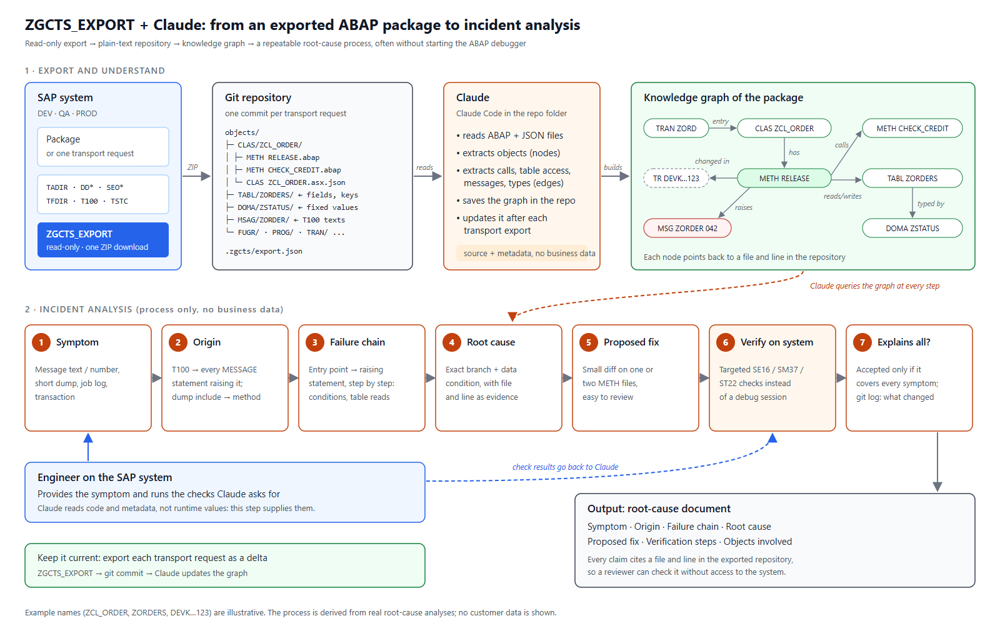

# AI-assisted debugging with Claude

Most of the time spent on an ABAP incident goes into *finding* things, not fixing them:
- where a message is raised
- which call path actually ran
- what a status value means
- which transport changed a method recently

Then come the debugging sessions, often on a system where you can't debug at all.

This guide shows how to use a ZGCTS_EXPORT export with **Claude** so that most of that work becomes *asking questions about the code* instead of *stepping through it*.



---

## Why the export works well as AI input

| Export feature | Why it matters |
|---|---|
| One file per method | Claude can cite `METH RELEASE.abap` line 42 instead of "somewhere in the class", and every claim can be checked in seconds |
| Dictionary data as JSON | Exact field names, keys, domain fixed values and message texts, so Claude reads them instead of guessing |
| Folders by object type and package | Claude can scan all tables, all message classes or one subpackage directly |
| Transport request mode | One Git commit per transport, so "what changed recently?" is answered with `git log` |
| Read-only, source and metadata only | Nothing is written to SAP, and no business data is exported |

---

## Step 1: Export

1. Run ZGCTS_EXPORT with **Export the whole package**, tick **Include SubPackages**, and choose a **Frontend Download Folder**. See [usage.md](usage.md).
2. Unzip the result into a new folder and run `git init`, then commit. That's the baseline.
3. After that, export each transport request as a delta (with the same root package) and commit it. This keeps the repository in step with the system.

## Step 2: Set up Claude

1. Copy [CLAUDE.template.md](CLAUDE.template.md) to the root of the export repository as `CLAUDE.md`. It explains the layout to Claude and sets the analysis rules (cite file and line, never guess runtime values, and so on).
2. Start **Claude Code** in the repository folder.
3. Build the knowledge graph once:

```text
Read every file under objects/ and build a knowledge graph of this package in
kg/graph.json. Nodes: packages, classes, methods, function modules, programs,
transactions, tables, fields, domains with their fixed values, messages.
Edges: calls, reads, writes, raises (MESSAGE and exceptions), typed-by,
implements/inherits, entry-point-of. Every node and edge must carry the file
path and line it was derived from. Then write kg/README.md listing the entry
points (transactions, reports, batch-relevant function modules) and the
message classes with the statements that raise each message.
```

4. After each new transport export:

```text
The last commit is a new transport export. Update kg/graph.json for the
changed files only, and summarize what changed functionally.
```

### What goes into the graph

| Graph element | Read from the export |
|---|---|
| Packages and objects | Folder structure, `TADIR` rows |
| Methods, function modules, signatures | `METH` / `FUNC` files, `SEOCOMPO`, `FUPARAREF` |
| Tables, keys, foreign keys | `DD02L`, `DD03L`, `DD05S`, `DD08L` |
| What a status value means | Domain fixed values in `DD07L` / `DD07T` |
| Message texts | `T100` rows in each message class |
| Short-dump include → method | `TMDIR` (the `CMnnn` includes named in ST22) |
| Entry points | Transactions (`TSTC`), reports, function modules |
| Changes | `.zgcts/export.json` and `git log` |

---

## Step 3: The 7-step incident analysis process

This process comes from a series of real root-cause analyses. No business data is needed: the symptom from the ticket and a few checks on the system are enough. The examples use made-up demo names.

### 1. Symptom
Start with what the ticket gives you: the message text or number, the short dump (runtime error, program, include, line), the job log, or the transaction.

```text
Users get "Order cannot be released (status check)" in transaction ZDEMO_ORD.
It only happens in the nightly batch job, never online. Start the analysis.
```

### 2. Where the message actually comes from
Claude finds the text in the `T100` rows, gets the message number, and lists **every** statement that raises it. There is often more than one, and the exact wording or message type decides which one it is. For a short dump, `TMDIR` maps the include and line straight to a method file.

```text
Short dump GETWA_NOT_ASSIGNED in ZCL_DEMO_ORDER=======CM004, line 37.
Which method is that, and what has to be true for line 37 to fail?
```

### 3. The failure chain
Claude walks the graph from the entry point (transaction, report or batch job) to that statement, step by step: which method runs, which condition is checked, which table is read, and what happens if that read returns nothing.

```text
Trace the path from the batch entry point to each MESSAGE statement you found.
For every step give file and line, the condition, and what differs between
online and background processing.
```

### 4. Root cause
Claude names the exact branch and the data condition that makes it run, with a file and line for every claim.

### 5. Proposed fix
The fix is a small diff on one or two `METH` files. Ask for the impact as well:

```text
Propose the minimal fix. List every caller of the changed method and whether
its behavior changes.
```

### 6. Verification on the system
This step replaces the debugging session. Claude lists the checks that confirm or rule out the root cause, someone runs them, and the results go back to Claude.

```text
List the minimal checks on the system that would confirm or rule out this
root cause. Table, key fields and the value you expect for each.
```

### 7. Why this explains all observed behavior
A cause is only accepted if it explains **every** observation in the ticket, such as why it fails only in background or only since a certain date. `git log` on the method files shows which transport changed them and when.

```text
Does this root cause explain every observation in the ticket? Check git log
for the files on the failure chain: did a recent transport change them?
```

**Output:** a root-cause document with the sections Symptom, Origin, Failure chain, Root cause, Proposed fix, Verification on the system, Why this explains all observed behavior, and Objects involved. Every claim cites a file and line, so a reviewer can check it without access to the system.

---

## Where the time savings come from

| Task | Classic approach | With the export and Claude |
|---|---|---|
| Find where a message is raised | Where-used lists through several layers | One question; every raising statement listed with file and line |
| Understand an unfamiliar call path | Read through SE80, set breakpoints, step through | Graph walk from entry point to failure, written down step by step |
| Reproduce the problem | Get test data and access, often impossible on the system where it fails | Usually not needed: a few targeted table checks confirm the branch |
| Decode statuses and fields | Look up domains in SE11 one by one | Domain values are already in the graph |
| "Did something change?" | Version history per object, transport by transport | `git log` on the affected files, one commit per transport |
| Short dump in a class | Map the `CMnnn` include to a method by hand | `TMDIR` lookup gives the method file directly |
| Write the RCA | Rebuild the analysis from notes | The analysis *is* the RCA, already cited |

The fix itself still takes as long as it takes. The savings come from the search, the tracing and the debugger sessions.

---

## Guardrails

- **Runtime values.** Claude reads code and dictionary data, not live data. If a failure depends on specific data, step 6 still needs someone on the system. Usually that's a quick table check, not a debugging session.
- **Verification.** Claude can be wrong. Citing a file and line for every step is what makes its reasoning quick to check. Treat the result as a well-supported hypothesis until the checks on the system confirm it.
- **An up-to-date export.** The analysis is only as current as the export, so export each transport as a delta.
- **Your company's rules.** The export contains source code and repository metadata, not business data. Before you share it with any AI service, check your company's policy on source code.
