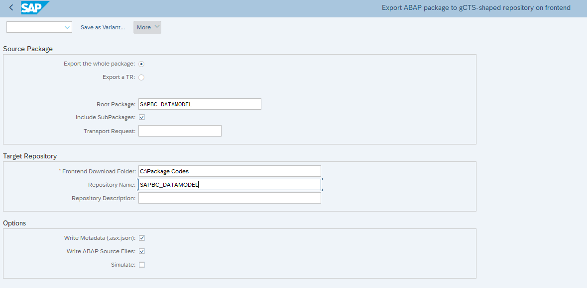
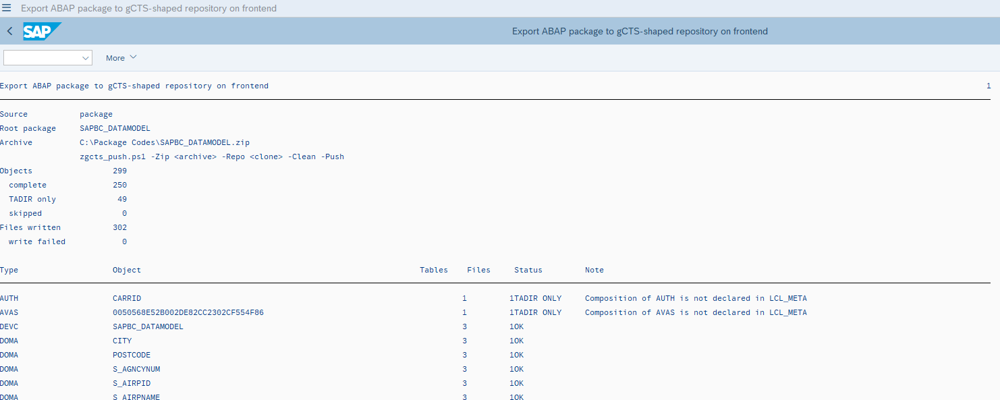

# Usage

## Selection screen



| Block | Field | Meaning |
|---|---|---|
| Source Package | *Export the whole package* / *Export a TR* | Export mode: full package or one transport request |
| | Root Package | Package to export (package mode, required). Root package for folder paths (request mode, optional) |
| | Include SubPackages | Walks down the package hierarchy in `TDEVC` |
| | Transport Request | Request to export (request mode, required) |
| Target Repository | Frontend Download Folder | Where the ZIP is downloaded (F4 opens a folder picker) |
| | Repository Name / Description | Written to `.gcts.properties.json`. Defaults to the package name and description |
| Options | Write Metadata (.asx.json) | Writes the `.asx.json` files |
| | Write ABAP Source Files | Writes the `.abap` files |
| | Simulate | Runs everything but downloads nothing |

The checks done when you press Execute:
- In package mode, a package is required and must exist.
- In request mode, a request is required and must exist in `E070`. A package is optional, but if you enter one, it must exist.

## Output file

All files are built in memory and downloaded at the end in **one** step, as a single ZIP:

| Mode | ZIP name |
|---|---|
| By package | Package name, with `/` replaced by `_` and leading `_` removed: `/NS/PKG` → `NS_PKG.zip` |
| By transport request | Request number: `DEVK900123.zip` |

## Result list



After the run you get a summary (mode, root package, archive path, counts) and one line per object:

| Column | Meaning |
|---|---|
| Type / Object | `R3TR` object type and name |
| Tables | Number of tables written into the object's `.asx.json` |
| Files | Number of files written for the object |
| Status | See below |
| Note | Reason for any status other than `OK` |

| Status | Meaning |
|---|---|
| `OK` | Object exported completely |
| `TADIR ONLY` | The object type has no table mapping, so only its `TADIR` entry (and its source, if any) was exported |
| `SKIPPED` | Nothing readable was found for the object |
| `UNRESOLVED` | Request mode: an entry in `E071` could not be mapped to a whole (`R3TR`) object |
| `NO TADIR` | Request mode: the entry was mapped to an object, but that object has no `TADIR` entry, so its package and folder are unknown |

## Git workflow

```text
1. Export the whole package         → ZDEMO.zip
2. Unzip into a new Git repository  → git add . && git commit -m "Baseline ZDEMO"
3. For each released transport request:
     export the TR (Export a TR)    → DEVK900123.zip
     unzip over the clone           → git add . && git commit -m "DEVK900123 <request text>"
4. git log / git diff / your IDE    → change history with one commit per request
```

For a request export, enter the same root package you used for the baseline. The changed objects then land in the same folders as in the full export.

A request export does **not** rewrite `.gcts.properties.json` or `README.md`, because changing those in every commit would only add noise. It does rewrite `.zgcts/export.json`. That file contains a timestamp, so every request export creates a commit, even if the source code is unchanged.

To refresh the full snapshot, clear the `objects/` folder of your clone before unzipping a new package export. Otherwise objects that were deleted in SAP stay in the repository.

> **Note:** At the end of the result list, the report prints a sample command line for a helper script, `zgcts_push.ps1`. That script is not included in this repository. Unzip and commit by hand, as shown above, or with any script you prefer.
